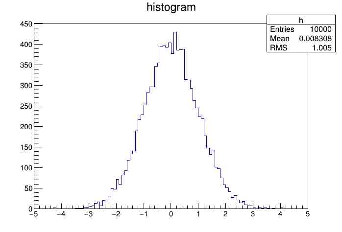

##直方图histogram
[TH1官网链接](https://root.cern.ch/doc/master/classTH1.html)  
####什么是直方图
直方图是ROOT里面最常用的一个工具。直方图的概念也很简单，我们以一维直方图TH1D为例来说明.
假设一个班级有50人，他们的身高怎么分布的？我们就可以用一个最简单的直方图表示如下：
  
其中横轴是身高，纵轴是统计数目。实验上的直方图跟这个是一样的道理，只不过实验上的事例数一般多得多.  
####ROOT里面怎么画直方图
在理解了直方图后我们介绍ROOT的直方图.
ROOT中是所有类都以T开头，TH1中的H表示Histogram，1表示一维直方图，后面的C,S,I,F,D表示数据类型，比如TH1D表示双精度的一维直方图。
自然想到还会有TH2,TH3等，他们的具体含义跟TH1类似。具体信息查看本节开头给的链接。我们一般常用TH1D,以后的栗子也以TH1D举例.  
实验物理中，直方图一般用来表示某种分布，根据直方图可以得到某些我们想要的信息。比如开头我们讲的身高的分布，如果样本到几百几千，
我们可能会发现身高服从高斯分布。再比如在物理实验中，根据末态粒子的不变质量谱的分布，可以推测中间有没有共振态.  
下面我们来讲怎么使用直方图，直接来看一个栗子.  
h1.C  
```
{
TH1D *h = new TH1D("h","histogram",100,-5,5);  //构造函数,创建一个空直方图
h->FillRandom("gaus",10000);                    //用高斯模型填充直方图
h->Draw();                                      //画图
}  
```
启动root后把上面代码块中间三行逐行输入root中，或者把这五行，包括开头跟结尾的大括号，复制保存到h1.C文件，然后运行
``
root h1.C
``
如果你能看到如下所示的直方图,那么恭喜，你已经完成了一个完整的直方图程序，就是这么简单  
  
下面逐行对这段代码进行解释:   
&emsp;构造函数这一行，是创建一维直方图的常用做法。``new TH1D("h0","histogram",100,-5,5)``表示创建一个名字叫h0,标题是histogram,分 100 个bin,范围是 -5 到 5 的一维直方图.
"new" 是c++的操作符，表示动态申请一个新的内存空间来存放这个直方图.其中名字h0是直方图的唯一标识符，就跟人的身份证一样，同一个程序中每个直方图都有唯一的身份证号码，
不可重复,另外,我这里特地把名字设为"h0",是为了告诉读者，这个名字跟"TH1D \*h "中的"h"没有任何关系，虽然大部分栗子以及教程都把他们设置为相同，设置为相同的目的只是为了方便而已。
标题histogram是可以重复的，不同的直方图可以有不同的标题，就跟不同的人可以穿相同的衣服一样。100,-5,5这三个量表示把 -5 到 5 这个距离均等分成 100 份,100 是bin的数目，-5是起始值,
5是终止值. "TH1D \*h" 表示"h"是个指向TH1D的指针，"="表示把刚才申请开辟的内存空间的地址赋值给了"h".
上面这是c++的基本语法,TH1D重载了多个构造函数，具体可以参考本节开头的链接。  
&emsp;填充直方图这一行,"FillRandom"函数是TH1D的公有成员函数,实现随机生成数据填充直方图的功能，其中参数"gaus",10000表示以高斯函数的形式填充10000次。"->"是c++中使用指针调用成员函数
的操作符.  
&emsp;画图这一行直接调用TH1D的成员函数Draw()画出我们填充的直方图.  
#### 再谈填充直方图
&emsp;好了,通过前面的介绍你应该对一个直方图怎么创建，怎么填充，怎么画图有了一点点认识.你可能也会产生疑问，实际工作中，到底是怎么填充直方图?下面我们就一步步讲解，在实际工作中，
直方图一般是怎么使用的。
&emsp;实际工作中，我们往往需要从文件读取数据，把数据填充到直方图，上面那个FillRandom的方法就不适用了。这时候我们一般是通过循环来实现的，看下面的代码:    
h2.C
```
{
TRandom r;
double  x=0.;
TH1D *h2 = new TH1D("h2","histogram",100,-5,5);  //构造函数,创建一个空直方图
for(int i=0;i<10000;++i){ //循环
    x = r.Gaus(); //产生一个服从高斯分布的随机数
    h2->Fill(x);  //填充直方图
}
h2->Draw();
}
```
&emsp;把上述代码存储为h2.C并用``root -l h2.C``执行后，可以看到几乎跟h1.C完全一样的结果.这里我们使用随机数，一是为了跟前面的结果对比，另一个原因就是省去ROOT从文件读取数据的麻烦,
把重点放在填充上，在后面介绍完从文件读取数据后再回过头来填充直方图.  
//TODO 介绍常用成员函数  
//介绍root脚本运行方式  
